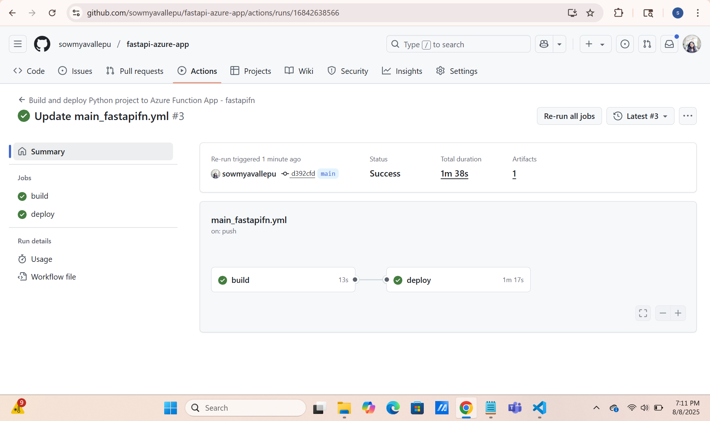
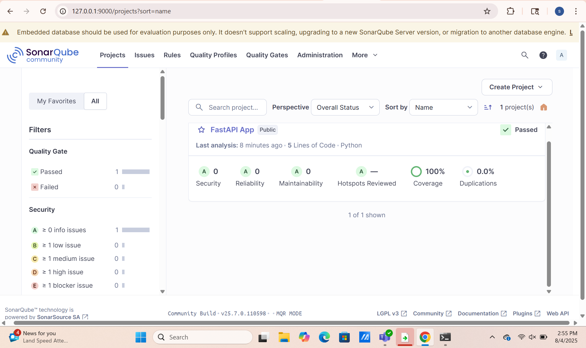

# FastAPI Azure App – Project Summary & Quality Report

# Overview

This project demonstrates deploying a FastAPI application to Azure Functions using GitHub Actions for CI/CD and SonarQube for continuous code quality and coverage analysis.

---

## Features

- FastAPI application deployed to Azure
- Automated CI/CD with GitHub Actions
- SonarQube integrated for code quality and coverage
- Achieved **100% test coverage** (manager requirement: 95%+)

---

## Results

### 1. FastAPI Application Running

The FastAPI app is deployed and accessible. Example response from the application:

---

### 2. GitHub Actions CI/CD Pipeline

Automated pipeline for build and deploy is successful:

---

### 3. SonarQube Quality Gate and Coverage

SonarQube analysis displays:
- Quality Gate: Passed
- **Code Coverage: 100%**
- 0 security, reliability, or maintainability issues

---

## Key Achievements

- **Deployment:** FastAPI app runs on Azure, accessible via public endpoint.
- **CI/CD:** Every push triggers build & deploy using GitHub Actions.
- **Quality:** SonarQube integration with 100% code coverage, passing all gates.
- **Documentation:** All steps, results, and quality metrics are available in this document.

---

## How to Reproduce

1. Clone the repository.
2. Review the workflow in `.github/workflows/main_fastapifn.yml`.
3. Push changes to trigger build, test, and deployment.
4. SonarQube results are updated on each push.

---

## Coverage Proof

- SonarQube dashboard shows **100% coverage** (requirement: 95%+ achieved and exceeded).
- All tests are maintained in the `tests/` directory.

---

## Notes

- For more details, see the repository files and actions logs.
- If you have further requirements for quality or pipeline modification, feel free to open an issue or reach out.

---

## Security Demo
This repository demonstrates comprehensive security scanning with vulnerability detection.

## Security Demonstration
This repository demonstrates enterprise-grade security scanning with:
- 🛡️ Package vulnerability detection (Safety)
- 🔍 Code security analysis (Bandit)  
- 🎯 Quality gate enforcement (SonarQube)
- ❌ Build failure on security issues
- 🚫 Deployment blocking for vulnerable code
